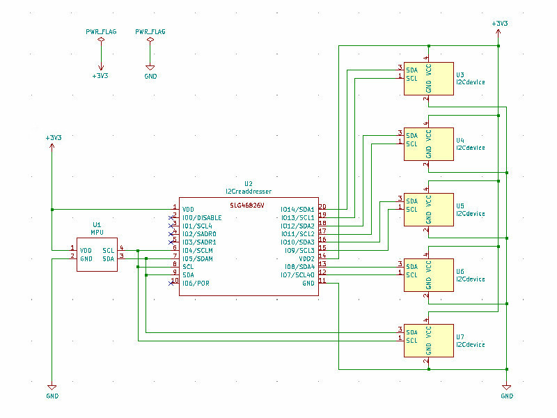

#  I2C address readdresser using GreenPAK.  (緑豆壱拾伍號)

GreenPAK用のデザインデータです。  
SLG46826V(STQFN) または SLG46826G(TSSOP) に対応しています。  
同じアドレスをもつ複数のI2Cデバイスへのアクセスを可能にします。  

## 機能
- 同じアドレスを持つ複数のスレーブデバイスを１つのマスターから個別に制御可能  
- マスターの口：１、スレーブの口：４ に対応  
- 端子制御なしに通常のI2Cアクセスフォーマットでのデバイス選択が可能  
- 異電源電圧間の通信が可能  

### 注意
本デザインは、スレーブの口ごとにデバイスをひとつづつ接続することを想定しています  

### 本デザインの使用イメージ
パスコンは省略してあります。  
  

## ピンアサイン

STQFN Pin # | TSSOP Pin # | 機能名 | IO | 内蔵抵抗 | SLG46826端子名 | 機能
--- | --- | --- | --- | --- | --- | ---
1 | 20 |VDD | - | - | VDD | 2.3V～5.5V for VDD side
2 | 19 | DISABLE | I | PD10k | IO0 | 1: connection disable
3 | 18 | SCL4 | IO | PU10k | IO1 | SCL No.4 to slave
4 | 17 | SADR0 | I | PU100k | IO2 | Slave address selection A4
5 | 16 | SADR1 | I | PD100k | IO3 | Slave address selection A5
6 | 15 | SCLM | IO | PU10k | IO4 | SCL from master
7 | 14 | SDAM | IO | PU10k | IO5 | SDA from master
8 | 13 | SCL | I | - | SCL | SCL for SLG46826
9 | 12 | SDA | IO | - | SDA | SDA for SLG46826
10 | 11 | POR | O | - | IO6 | Power on reset monitor. 0: Reset
11 | 10 | GND | - | - | GND | GND
12 | 9 | SCL4O | O | PU10k | IO7 | SCL No.4 to slave (option)
13 | 8 | SDA4 | IO | PU10k | IO8 | SDA No.4 to slave
14 | 7 | VDD2 | - | - | VDD2 | 1.71V～VDD for VDD2 side
15 | 6 | SCL3 | IO | PU10k | IO9 | SCL No.3 to slave
16 | 5 | SDA3 | IO | PU10k | IO10 | SDA No.3 to slave
17 | 4 | SCL2 | IO | PU10k | IO11 | SCL No.2 to slave
18 | 3 | SDA2 | IO | PU10k | IO12 | SDA No.2 to slave
19 | 2 | SCL1 | IO | PU10k | IO13 | SCL No.1 to slave
20 | 1 | SDA1 | IO | PU10k | IO14 | SDA No.1 to slave
  
### 内蔵抵抗
各端子の内蔵抵抗を有効にしてありますので、I2Cの外付けプルアップ抵抗などを省略できます。  
記号はおおよその抵抗値を表しており、値は以下の通りです。  
- PD10k: Pull-down 10k ohm  
- PD100k: Pull-down 100k ohm  
- PU10k: Pull-up 10k ohm  
- PU100k: Pull-up 100k ohm  

### 異電源対応
STQFN版のPin #1～10 および TSSOP版のPin #11～20は、VDD電源で動作します。2.3V～5.5V の範囲で使えます。  
STQFN版のPin #11～20 および TSSOP版のPin #1～10は、VDD2電源で動作します。1.71V～VDD電源の電圧まで使えます。  

### DISABLE端子の使い方
DISABLE=1とするとプルアップ抵抗を有効としたままマスター側とスレーブ側の通信を遮断します。  
DISABLE=0ではノーマル動作となります。  
DISABLEを使わない場合はGND接続またはopenとします。  

### SCL4O端子の使い方
クロックストレッチ†を行わないデバイスに対して、SCL4の代わりに使うことができます。  
SCL4Oを使う場合は、SCL4はオープンとしてください。  
SCL4Oを使わない場合は、SCL4Oをオープンとしてください。  

†クロックストレッチ  
　スレーブ側がデータを送信するときに、処理時間が間に合わないなどの理由で強制的にクロックラインをLowにしてマスタ側が次のクロックを送信するのを待たせる機能。  

### コントロールコードの設定

コントロールコードはSLG46826の7ビットのスレーブアドレスの上位4ビットに対応します。  
コントロールコードはSADR1、SADR0端子で設定します。  

SADR1 | SADR0| コントロールコード | 占有アドレス
--- | --- | --- | ---
open | open | 0001 | 0001xxx
0 | 0 | 0000 | 0000xxx
0 | 1 | 0001 | 0001xxx
1 | 0 | 0010 | 0010xxx
1 | 1 | 0011 | 0011xxx

## 使い方

本デザインは、デバイスのアドレスをスレーブの口ごとに異なる仮アドレスをつけることで、同じアドレスを持つ複数のスレーブデバイスへの個別のアクセスを可能にしています。各スレーブアドレスへのリードライトアクセスは仮アドレスで行うことができます。  
仮アドレスのつけ方はデザイン中のProgrammable Pattern Generator (PGen)の パターンを書き換えることで変更することができます。    

### 仮アドレスの計算例

デフォルト(PGEN[15:0]=1111011100110000b)時の仮アドレスの計算例は以下の通りです。  

- デバイスのアドレスが、SLV[6:0]=0001000bの時  
  - SDA1の仮アドレス: SLV[6:0]^{PGEN[15:11],00b} = 0001000b ^ 1111000b = 1110000b = 70h  
  - SDA2の仮アドレス: SLV[6:0]^{PGEN[10: 6],00b} = 0001000b ^ 1110000b = 1111000b = 78h  
  - SDA3の仮アドレス: SLV[6:0]^{PGEN[ 5: 1],00b} = 0001000b ^ 1100000b = 1101000b = 68h  
  - SDA4の仮アドレス: SLV[6:0]^{PGEN[ 4: 0],00b} = 0001000b ^ 1000000b = 1001000b = 48h  

なお、手計算が面倒な方のために、EXCELファイルのaddressシートに自動計算シートを用意してあります。  
target欄の黄色いセルに７ビットのアドレスを16進数で書き込むことで、アドレスが自動計算されます。  
また、デザイン中のPGENのパターンを変更した場合は、パターン欄の黄色いセルを書き換えることで、アドレスが自動計算されます。  

## 設計データ

「GreenPAK6 Designer」で  
I2Creaddresser.gp6  
を開き、必要に応じてProgrammable Pattern Generator (PGen)の パターンを編集してご利用ください。  
SLG46826G に焼く場合は、File-Project info で Packageを「TSSOP-20」に変更してください。

## 免責事項

当方は、利用者に対して、このデザインおよびこの資料（以下、本デザイン等）に関する当方または第三者が有する著作権、特許権、商標権、意匠権及びその他の知的財産権をライセンスするものではありませんし、本デザイン等の内容についていかなる保証をするものでもありません。また当方は、本デザイン等を用いて行う一切の行為について何ら責任を負うものではありません。本デザイン等の情報の利用、内容によって、利用者にいかなる損害、被害が生じても、当方は一切の責任を負いません。ご自身の責任においてご利用いただきますようお願いいたします。  

## Author  

[GitHub/AoiSaya](https://github.com/AoiSaya)  
[Twitter ID @La_zlo](https://twitter.com/La_zlo)  
